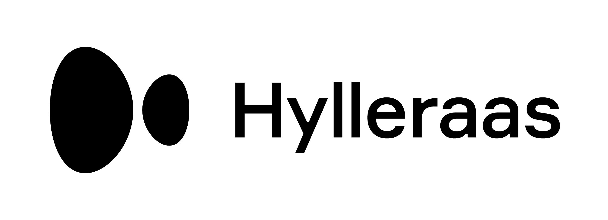

.. hymd documentation master file, created by
   sphinx-quickstart on Thu Dec 16 13:31:43 2021.
   You can adapt this file completely to your liking, but it should at least
   contain the root `toctree` directive.

###############################
HylleraasMD documentation
###############################

:Release:
   |release|
:Date:
   |today|

**HylleraasMD** (HyMD) is a massively parallel Python package for hybrid
particle-field molecular dynamics (hPF-MD) simulations of coarse-grained bio-
and soft-matter systems.

HyMD can run canonical hPF-MD simulations :cite:`Milano2009JCP`, or filtered
density Hamiltonian hPF (HhPF-MD) simulations :cite:`bore2020hamiltonian`, with
or without explicit PME electrostatic interactions :cite:`kolli2018JCTC`. It
includes all standard  intramolecular interactions, including stretching,
bending, torsional, and combined bending-dihedral potentials. Additionally,
topological reconstruction of permanent peptide chain backbone dipoles is
possible for accurate recreation of protein conformational dynamics
:cite:`Cascella2008,bore2018hybrid`. Martini
style elastic networks (ElNeDyn) :cite:`periole2009combining` are also
supported.

HyMD uses the pmesh (`github.com/rainwoodman/pmesh`_) library for particle-mesh
operations, with the PPFT :cite:`pippig2013pfft` backend for FFTs through the
pfft-python bindings (`github.com/rainwoodman/pfft-python`_). File IO is done
via HDF5 formats to allow MPI parallel reads.

User Guide
==========
The HylleraasMD :doc:`User Guide </doc_pages/overview>` provides comprehensive information on how to run
simulations. Selected :doc:`Examples </doc_pages/examples>` are available to guide new users.

.. _`github.com/rainwoodman/pmesh`:
   https://github.com/rainwoodman/pmesh
.. _`github.com/rainwoodman/pfft-python`:
   https://github.com/rainwoodman/pfft-python

Installing HyMD
===============
The easiest approach is to install using pip_:

.. code-block:: bash

   pip install hymd

For more information and required dependencies, see :ref:`installation-label`.

.. _pip:
   http://www.pip-installer.org/en/latest/index.html

Source Code
===========
**Source code** is available from
https://github.com/Cascella-Group-UiO/HyMD/ under the `GNU Lesser General Public
License v3.0`_. Obtain the source code with `git`_:

.. code-block:: bash

   git clone https://github.com/Cascella-Group-UiO/HyMD.git

.. _GNU Lesser General Public License v3.0:
   https://www.gnu.org/licenses/lgpl-3.0.html
.. _git:
   https://git-scm.com/

Development
===========
HyMD is developed and maintained by researchers at the `Hylleraas Centre for
Quantum Molecular Sciences`_ at the `University of Oslo`_.

|pic1| |pic2|

.. _`Hylleraas Centre for Quantum Molecular Sciences`:
   https://www.mn.uio.no/hylleraas/english/
.. _`University of Oslo`:
   https://www.uio.no/

References
==========
.. bibliography::
  :all:

Indices and tables
==================

* :ref:`genindex`
* :ref:`modindex`
* :ref:`search`

.. Contents
.. ========

.. toctree::
   :maxdepth: 2
   :numbered:
   :hidden:

   ./doc_pages/installation
   ./doc_pages/overview
   ./doc_pages/theory
   ./doc_pages/examples
   ./doc_pages/config_file
   ./doc_pages/topology_input
   ./doc_pages/command_line
   ./doc_pages/intramolecular_bonds
   ./doc_pages/electrostatics
   ./doc_pages/interaction_energy_functionals
   ./doc_pages/filtering
   ./doc_pages/constants_and_units
   ./doc_pages/benchmarks
